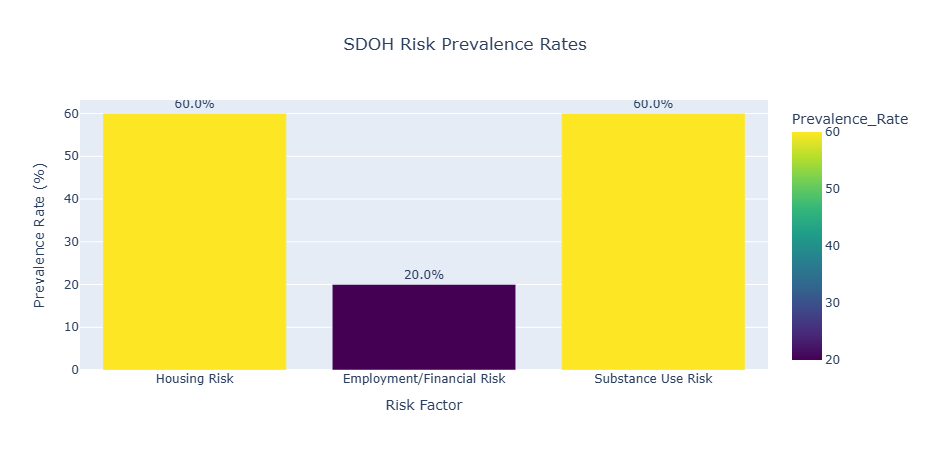

# 🩺 Clinical Text Mining: Identifying Social Determinants of Health (SDOH) Risk

## Project Overview
This project serves as a **Proof of Concept (PoC)** demonstrating a scalable, end-to-end data pipeline for transforming **unstructured clinical text** (mock patient discharge summaries) into structured, quantifiable analytical features.

Leveraging **15+ years of clinical domain expertise**, the goal was to identify and quantify the prevalence of key Social Determinants of Health (SDOH) risk factors—such as **Housing Instability**, **Financial Strain**, and **Substance Use**—to support targeted clinical intervention and resource allocation.

## 🔑 Key Technologies & Analytical Skills

| Area | Skill Demonstrated | Detail |
| :--- | :--- | :--- |
| **Big Data Platform** | **PySpark** & **Databricks** | Project executed on a Databricks cluster, utilizing PySpark for scalable data ingestion and distributed aggregation, simulating a **Big Data healthcare environment**. |
| **NLP/Feature Engineering** | **Regex** & **Pandas/PySpark UDFs** | **Engineered a custom NLP pipeline** to apply case-insensitive pattern matching (`rlike` in PySpark) against clinical text, creating clean, binary (1/0) risk flags for each SDOH category. |
| **Domain Expertise** | **Clinical Knowledge** | Applied deep knowledge to define precise and clinically relevant keyword dictionaries, ensuring high analytical specificity and feature accuracy. |
| **Data Visualization** | **Plotly** / **Seaborn** | **Communicated findings** using interactive **Plotly** bar charts to clearly visualize the prevalence rate of each risk factor, providing quick, actionable insights. |

---

## 🚀 Execution Workflow

The project validated a scalable ETL (Extract, Transform, Load) workflow for unstructured data:

1.  **Extract (E) & Load (L):** Mock patient notes were loaded directly into a PySpark DataFrame in Databricks.
2.  **Transform (T) - NLP Pipeline:** The core logic applied distributed transformations across the data:
    * **Text Cleaning:** Converted summaries to uppercase (`upper(col(...))`) for robust matching.
    * **Feature Creation:** Used PySpark's **`when().rlike()`** function with a custom built Regex pattern (e.g., `'HOMELESS|JOB LOSS|ALCOHOL USE'`) to assign risk flags (1) or (0).
3.  **Aggregation:** PySpark's **`df.agg(sum(...))`** function was used to calculate the final **Prevalence Rate (%)** for each risk factor across the patient cohort.

## 📊 Sample Results and Insights (Based on PoC Data)

The analysis successfully calculated the prevalence rates, demonstrating the efficacy of the pipeline:

* **Housing Risk:** 60%
* **Employment/Financial Risk:** 20%
* **Substance Use Risk:** 60%

> **Conclusion:** The successful implementation of this **PySpark PoC** confirms the pipeline's readiness to scale to millions of patient records, converting unstructured clinical documentation into vital, actionable intelligence for optimizing patient outcomes and resource allocation.

---

## 💡 How to Run the Code

This project is contained within the notebook file: https://github.com/SanthiVarma-24/Clinical_Text_Mining_PySpark_SDOH/blob/main/clinical_text_mining_project%202025-11-27%2015%3A13%3A31.ipynb

To run the code:
1.  Clone this repository into a **Databricks Git Folder**.
2.  Attach the notebook to a cluster.
3.  Run the cells sequentially.
